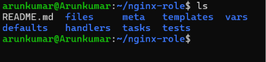

# Ansible Overview
This directory contains Ansible playbooks and roles for automating the deployment and management of various systems and applications. Ansible is an open-source automation tool that simplifies IT tasks such as configuration management, application deployment, and task automation.

# Getting Started with Ansible
1. Install Ansible on your control machine using wsl (windows subsystem for linux) in windows bcoz ansible is not supported natively on windows.

## Installation of wsl
```bash
wsl --install
wsl --version #Note: after restart windows
```
- install Ubuntu from MS STORE
- run following commands in this Ubuntu
```bash
sudo apt update
sudo apt upgrade -y
sudo apt install ansible
ansible --version
```
### Inventry creation
2. inventry:
    Ansible uses an inventory file to define the hosts and groups of hosts on which tasks will be executed. The default inventory file is located at `/etc/ansible/hosts`, but you can create your own inventory file in this directory.
    
    Example inventory file (`inventory.ini`):
    ```ini
    [webservers]
    web1.example.com
    web2.example.com
    
    [dbservers]
    db1.example.com
    db2.example.com
    ```
3. basic inventry
    ```bash
    touch hosts
    nano hosts
    ```
- in hosts file add below lines
    ```ini
    [myservers]
    localhost ansible_connection=local
    ```
    - to check connection
    ```bash
    ansible -i hosts myservers -m ping
    ```

### working with playbook
4. playbook
- yml files in which we use to write scripts, instructions 
    ```bash
    touch myplaybook.yml
    nano myplaybook.yml
    ```
- in myplaybook.yml file add below lines
    ```yaml
    ---
    - name: create a ansible file
        hosts: myservers
        tasks:
            - name: Create a file using Ansible
            file:
              path: "{{ ansible_env.HOME }}/ansible_test_file.txt" # creating file with name ansible_test_file in HOME variable that automatically replace with home directory name EG. root or username
              state: touch
              mode: '0644'
    ```
    - To run the playbook in hosts inventory
    ```bash
    ansible-playbook -i hosts myplaybook.yml
    ```
- explaination of above playbook:
    - `name`: A descriptive name for the playbook.
    - `hosts`: Specifies the target hosts or groups defined in the inventory file.
    - `tasks`: A list of tasks to be executed on the target hosts.
    - `file`: The Ansible module used to manage files and directories.
    - `path`: The path where the file will be created. Here, it uses a variable to get the home directory of the user.
    - `state`: Specifies the desired state of the file. In this case, `touch` creates an empty file if it doesn't exist.
    - `mode`: Sets the file permissions.
    - `ansible_env.HOME`: A built-in Ansible variable that retrieves the home directory of the user on the target host.
    - `0644`: File permission setting that allows the owner to read and write, while others can only read.
5. Running Playbooks
*syntax*:
```bash
ansible-playbook -i <inventory_file> <playbook_file>
```

## varibales and loops

```yaml
---
- name: Create multiple files using Ansible
  hosts: myservers
  vars:
    file_names:
      - file1.txt
      - file2.txt
      - file3.txt
  tasks:
    - name: Create files from the list
      file:
        path: "{{ ansible_env.HOME }}/{{ item }}"
        state: touch
        mode: '0644'
        loop: "{{ file_names }}"    
```
- for variable use vars keyword and use `{{ }}` to call the variable
- for loop use `loop` keyword

6. Task
- small actions like changing configuration etc.
7. Modules
- prewritten code which does specific task
8. Role
- structuring Modules

## working on remote machine (EC2)
- create a ec2 instance with ubuntu os
- connect to ec2 instance using ssh in local ubuntu software
### steps to perform on host machine
- paste the pem file in root directory of local ubuntu system
- in host machine open hosts inventry
```text
[aws]
ec2 ansible_host=<public_ip> ansible_user=<OS_name> ansible_ssh_private_key_file=path/of/pemfile
```
- run the command to test connection
```bash
ansible aws -i hosts -m ping
```
### working with playbook from local machine to remote machine
- open inventry file 
```bash
nano hosts
```
- add the following content
```text
[aws]
ec2 ansible_host=<public_ip> ansible_user=<OS_name> ansible_ssh_private_key_file=path/of/pemfile
```
- save the file
- create a playbook eg: nano `<file_name>.yml`
```bash
nano tags-ec2.yml
```
```yml
---
- name: Tags in Playbook
  hosts: aws #host name
  become: yes #sudo
  tasks:
    - name: Install nginx
      apt:
        name: nginx
        state: present
        update_cache: yes
      tags: install
    - name: Start nginx service
      service:
        name: nginx
        state: started
      tags: start
    - name: Create a File
      file:
        path: /root/example.txt
        state: touch
        mode: '0644'
      tags: create_file
```
- tags are used to run and identify that particular command 
- to run the tasks Eg: ansible-playbook -i `<inventryfile_name>` `<PLAYBOOK_FILE_NAME>` --tags `<TAG_NAME_WITH_SPACE_SEPARATED_IN_DOUBLE_QUOTES>`
```bash
ansible-playbook -i hosts tags-ec2.yml --tags "install start"
```
- to run commands from the local machine to remote 
```bash
ansible aws -i hosts -m shell -a "nginx -v"
```


### steps to perform on remote machine
- install ansible in ec2 instance
- create a inventory file in ec2 instance
- create a playbook in ec2 instance
- run the playbook

## Hanlers in Ansible
- handlers are used to run tasks when a task is changed
- handlers are defined in the end of the playbook
- handlers are triggered when a task is changed
- handlers are used to restart services when configuration files are changed

- create a playbook
```yml
---
- name: Using Handlers
  hosts: aws
  become: yes
  tasks:
    - name: Install nginx
      apt:
        name: nginx
        state: present
        update_cache: yes
    - name: Deploy nginx config File
      copy:
        content: "Welcome To Ansible"
        dest: /var/www/html/index.html
      notify: Restart nginx
  handlers:
      - name: Restart nginx
        service:
          name: nginx
          state: restarted
```
- run the playbook
```bash
 ansible-playbook -i hosts handlers-ec2.yml
``` 

## Roles in Ansible
- roles are used to organize playbooks and tasks
- roles are used to reuse code
- roles are used to make playbooks more readable
- roles are used to make playbooks more maintainable
- roles are used to make playbooks more portable

- to create role  Eg. ansible-galaxy init `<role_name>`
```bash
ansible-galaxy init webserver-role
```
- it is just a create-next-app . which will automatically give a organized template folders


- create a playbook in tasks directory
```yml
---
- name: Install and start nginx
  hosts: aws
  become: yes
  tasks:
    - name: Install nginx
      apt:
        name: nginx
        state: present
        update_cache: yes
    - name: Start nginx service
      service:
        name: nginx
        state: started
```
- run this playbook from the root directory with root playbook 
```yml
---
- name: Using Roles
  hosts: aws
  become: yes
  roles:
    - webserver-role
```
- run this root playbook
```bash
ansible-playbook -i hosts root-playbook.yml
```

## Facts in Ansible

- facts are variables that contain information about the remote system
- facts are automatically gathered by ansible
- facts are used to make decisions in playbooks
- facts are used to filter hosts
- facts are used to debug playbooks

- create a playbook - facts-example.yml
```yml
---
  - name: Install Nginx only on Ubuntu
    hosts: aws
    become: yes
    gather_facts: yes # this will gather facts about the remote system

    tasks:
      - name: Debug OS Name
        debug:
          msg: "OS is {{ ansible_facts['distribution'] }}" # this will print the OS name
      - name: Install Nginx only if Ubuntu
        apt:
          name: nginx
          state: present
        when: ansible_facts['distribution'] == "Ubuntu"
```
- run the playbook
```bash
ansible-playbook -i hosts facts-example.yml -l aws
```

## Ansible Vault

- ansible vault is used to encrypt sensitive data
- ansible vault is used to store passwords, tokens, keys, etc.

- create a playbook - secret.yml
```yml
API_KEY: "SOMTHING-SECRET"
```
- to Encrypt 
```bash
ansible-vault encrypt secrets.yml
```
- enter password
- to use this secret content
```yml
---
- name: Using Ansible Vault
  hosts: aws
  become: yes
  vars_files:
    - secrets.yml # encrypt file name
  tasks:
    - name: Print API Key
      debug:
        msg: "API Key is {{ api_key }}"
```
- to run this playbook we need to give password to access vault values in this playbook
```bash
ansible-playbook -i hosts secure-playbook.yml --ask-vault-pass
```

# questions
1. ansible is installed in local machine not in remote machine.
2. machine that are controlled are called managed nodes or hosts or remote machine/nodes.

