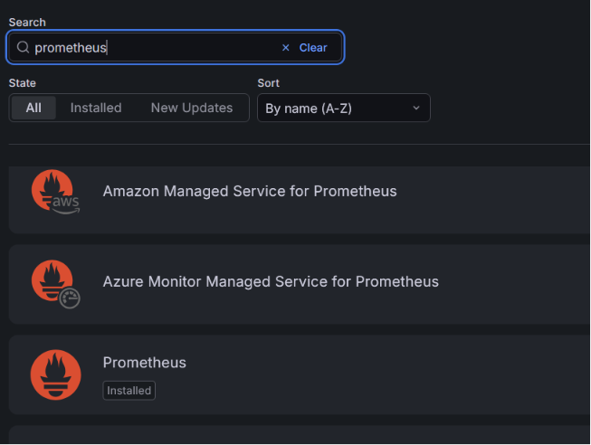

# grafana (visualizing) and prometheus (collecting data)
## installation of grafana and prometheus
1. update and upgrade the ubuntu system
``` bash
sudo apt update
sudo apt upgrade -y
```
2. install required packages such as `apt-transport-https` for secure package installation, `software-properties-common` for managing repositories, and `wget` for downloading files
``` bash
sudo apt install -y apt-transport-https software-properties-common wget
```
3. install grafana
``` bash
sudo wget -q -O /usr/share/keyrings/grafana.key https://packages.grafana.com/gpg.key
echo "deb [signed-by=/usr/share/keyrings/grafana.key] https://apt.grafana.com stable main" | sudo tee -a /etc/apt/sources.list.d/grafana.list
sudo apt update
sudo apt install grafana -y
```
4. refresh system services
```bash
sudo systemctl daemon-reload
```
5. start grafana server
```bash
sudo systemctl start grafana-server
```
6. check grafana server status
```bash
sudo systemctl status grafana-server
```
7. enable grafana server
```bash
sudo systemctl enable grafana-server
```
8. install prometheus and prometheus node exporter (collect machine data like cpu , resources etc)
```bash
sudo apt install prometheus prometheus-node-exporter -y
```
9. enable and start prometheus and prometheus node exporter
```bash
sudo systemctl enable --now prometheus prometheus-node-exporter
```
10. login to grafana. open `localhost:3000` for grafana and `localhost:9090` for prometheus

## creating first dashboard in Grafana
### Connecting Grafana to Prometheus
1. open `localhost:3000` and login with `admin/admin`
2. menu -> connections -> search prometheus
3. add prometheus server -> `http://localhost:9090` on add new data source

4. save and test 

### Creating Dashboard
1. click on `create your first dashboard` or `add new panel`
2. select the data source (prometheus)
3. select visualization type (Time series, Graph, Table, etc.)
4. write query to fetch data
```example
up
```
5. in options -> legend -> set alias as `{{instance}}`
6. save the dashboard

# For reference 
- for installtion of Grafana and Prometheus [check this repo](https://github.com/farzeen-ali/Grafana-and-Prometheus-Installation-on-Ubuntu)

- first dashboard [check this repo](https://github.com/farzeen-ali/Grafana-Monitoring-Dashboard-Setup)

- steps to monitor Express app [check this repo](https://github.com/farzeen-ali/Monitor-Express-JS-App-using-Prometheus-and-Grafana)

- Email alerts [check this repo](https://github.com/farzeen-ali/Send-Email-Alerts-using-Grafana-and-Prometheus)

